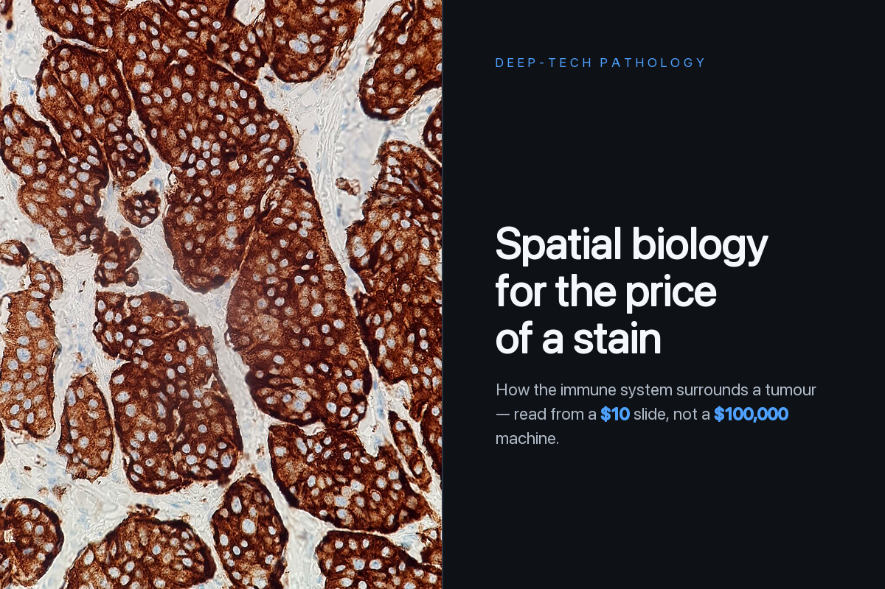
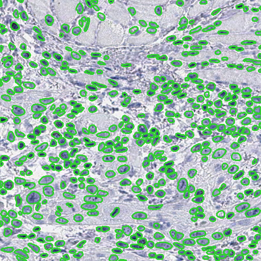
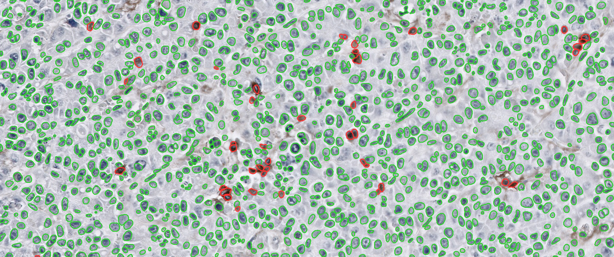
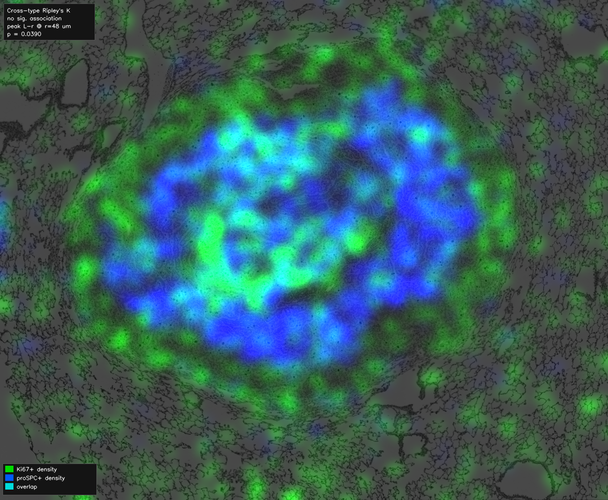
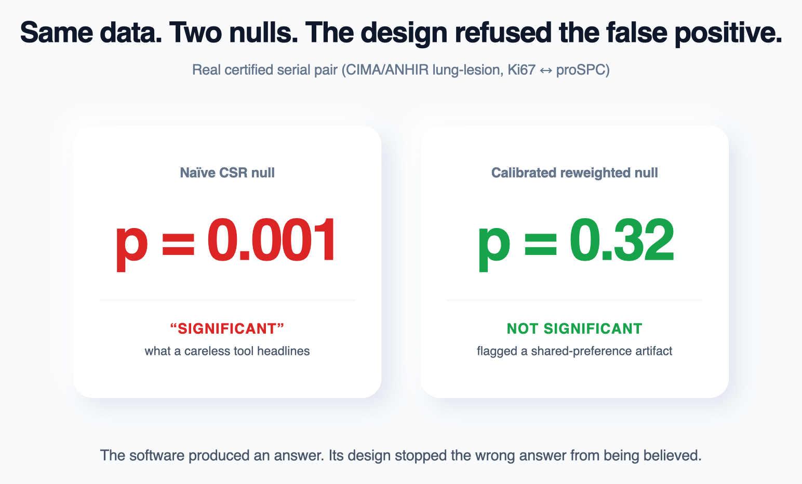
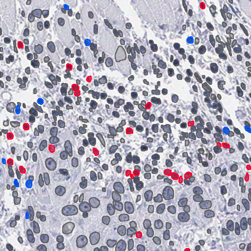

<!-- OASIS — Open Access Spatial IHC System. Public showcase repository. -->

  

<h1 align="center">OASIS</h1>

  

  <b>Open Access Spatial IHC System — a computational pathology platform for trustworthy spatial analysis of brightfield immunohistochemistry.</b>

  
  
  
  

  <a href="https://oasis-interactivedemo.vercel.app"><b>▶&nbsp;&nbsp;Try the Interactive Demo</b></a>
  &nbsp;&nbsp;·&nbsp;&nbsp;
  <a href="https://drive.google.com/drive/folders/1N3wTEH9Won0i12BUm7qTa2qOzFoo7s2J?usp=share_link"><b>📂&nbsp;&nbsp;View Outputs, Overlays & Supporting Results</b></a>
  &nbsp;&nbsp;·&nbsp;&nbsp;
  <a href="https://github.com/smukilan9-ship-it/OASIS-showcase"><b>GitHub Showcase</b></a>

 

---

## Experience it in two minutes

> **The best way to understand OASIS is to use it.**
>
> The **[Interactive Demo](https://oasis-interactivedemo.vercel.app)** walks you through the entire platform — batch processing, segmentation, quantification, spatial analysis, validation, and reporting — on preloaded example data. No installation, no setup, no uploads.

  <a href="https://oasis-interactivedemo.vercel.app"><b>→&nbsp;&nbsp;Launch the Interactive Demo</b></a>

---

## What it is

**OASIS — the Open Access Spatial IHC System — is an end-to-end computational pathology platform for brightfield immunohistochemistry.** It takes the slides a pathology lab already produces and carries them through one reproducible, validation-aware pipeline: batch processing, segmentation, quantification, spatial analysis, validation, and reporting.

It is **free and open-access**, scalable from a single slide to an entire study, and built around the pathology infrastructure labs already have. Every result it produces is backed by an explicit validity check — the trust isn't a disclaimer bolted on at the end, it's built into the workflow.

---

## Why it exists

Computational pathology is fragmented. Getting from a raw slide to a defensible spatial result usually means moving between several independent tools — one for segmentation, another for quantification, another for statistics, another for figures — stitched together by hand and trusted on faith.

**OASIS unifies that workflow into a single computational instrument.** Its accessibility comes from software, not specialized infrastructure: the capability lives in the platform, so any lab working with ordinary brightfield IHC can reach analysis that was previously scattered across disconnected, expert-only tooling.

---

## Why OASIS?

Most tools solve a single stage of the problem. OASIS is built to do the whole thing — and to be trustworthy at every step.

It unifies the entire workflow into one platform:

- **Batch processing**
- **Segmentation**
- **Quantification**
- **Spatial analysis**
- **Validation**
- **Reporting**

Its defining philosophy is simple:

> **Every computational conclusion should be reproducible, reviewable, and explicitly validated before it reaches the researcher.**

That principle — not any single algorithm — is what sets OASIS apart. Results aren't just produced; they are certified, gated, and inspectable, so a researcher can defend every number the platform reports.

---

## Inside the platform

A single guided pipeline replaces a folder of disconnected tools — from a raw slide to a defensible, validation-aware report.

### 🗂️ Batch processing

Point it at a folder and it processes an entire experiment automatically — every slide segmented, quantified, and exported, with no manual transfers or per-image babysitting. **This is the difference between a script and a platform.**

### 🔬 Segmentation & quantification

Every nucleus is detected on commodity brightfield, and DAB optical density is measured per cell to count marker-positive cells — reported with overlays you can inspect down to the individual cell.

### 🧭 Spatial analysis

For two markers across serial sections, the platform measures how their cell populations sit in space — but only after the alignment between sections is **certified**, and only inside the region that can be trusted. Density overlays make the relationship visible at a glance.

### ✅ Validation & trust

The platform is engineered to **say no.** On a real certified pair, a naïve test reported a strong association (p = 0.001); the calibrated test returned p = 0.32 and flagged it as a shared-tissue artifact. **Same data — the design is what stopped the wrong answer from being believed.**

### 🧬 Same-section co-expression

When two stains are imaged on the *same* physical section, the exact same cells are reused to call true single-cell co-expression — here, CD8 versus FOXP3.

### 📄 Reporting

Every run produces clean, reproducible outputs — overlays, tables, and a validation-aware summary that separates what is supported from what is not.

---

## Why it matters

Advanced spatial analysis shouldn't be the privilege of a handful of well-funded centres. By running on the stains, scanners, and archived slides that pathology labs already have, OASIS brings trustworthy spatial analysis within reach far more widely — **without ever trading rigor for accessibility.**

---

  <a href="https://oasis-interactivedemo.vercel.app"><b>▶&nbsp;&nbsp;Experience the Interactive Demo</b></a>

  OASIS — Open Access Spatial IHC System. An end-to-end, validation-aware, reproducible computational pathology platform, built around the infrastructure labs already have.

